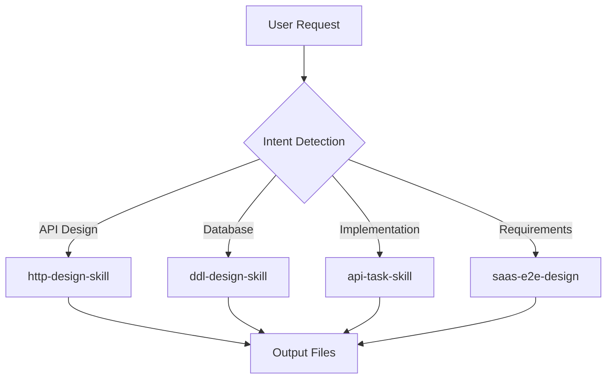

# Skills Rules & Configuration

This document records all available skills and their locations for the message-module project.

---

## External Skills Location

**Saas Skills Repository**: `../saas-skills/`

Two main skill directories available:

| Directory | Purpose |
|-----------|---------|
| `saas-e2e-design` | Full 8-phase requirement analysis and design workflow |
| `saas-api-design` | API-focused design with task breakdown |

---

## Available Skills Catalog

### 1. Core Design Skills (from saas-e2e-design)

| Skill Name | Location | Purpose |
|------------|----------|---------|
| **saas-e2e-design** | `../saas-skills/saas-e2e-design/SKILLS.md` | Phase I-VIII requirement analysis and design workflow |
| **saas-api-design** | `../saas-skills/saas-api-design/SKILL.md` | API-focused design with task breakdown |

### 2. Sub-Skills (shared in both directories)

| Skill Name | Primary Location | Also Available In | Purpose |
|------------|------------------|-------------------|---------|
| **api-task-skill** | `saas-e2e-design/api-task-skill/SKILL.md` | `saas-api-design/api-task-skill/` | EAV-Rust API implementation (8 phases) |
| **ddl-design-skill** | `saas-e2e-design/ddl-design-skill/SKILL.md` | `saas-api-design/ddl-design-skill/` | Database DDL script generation |
| **http-design-skill** | `saas-e2e-design/http-design-skill/SKILL.md` | `saas-api-design/http-design-skill/` | REST Client `.http` test case generation |

---

## Phase Workflow Overview

The saas-e2e-design skill defines an 8-phase workflow:

```
Phase I   → Requirements Analysis (requirements.md)
Phase II  → Business Analysis (business-analysis.md)
Phase III → Domain Decomposition (module-{domain}-requirements.md)
Phase IV  → Architecture Design (module-{domain}/module-{domain}-design.md)
Phase V   → Data Model & API Design (DDL + API docs + HTTP tests)
Phase VI  → Cross-Domain Flows (inter-domain-flows.md)
Phase VII → E2E Testing (acceptance-criteria.md)
Phase VIII→ Task Breakdown (task-list.md)
```

---

## Skill Triggering Rules

### User Intent Detection

When users request certain tasks, the corresponding skill should be triggered:

| User Request | Trigger Skill |
|--------------|---------------|
| "设计API", "生成接口文档", "API设计" | `http-design-skill` |
| "生成数据库脚本", "DDL设计", "数据库Schema" | `ddl-design-skill` |
| "实现EAV API", "Rust实现", "API全流程" | `api-task-skill` |
| "需求分析", "业务建模", "领域划分" | `saas-e2e-design` |
| "生成测试用例", ".http文件", "REST测试" | `http-design-skill` |

---

## Project-Specific Skills Context

### Current Project: message-module

- **Technology Stack**: Rust, Axum, PostgreSQL, Redis, RabbitMQ
- **Project Type**: Multi-tenant SaaS message system
- **Key Domains**: Message templates, Messages, User messages, Target rules, Push logs

### Applicable Skills

1. **ddl-design-skill** - Generate/validate database migrations
2. **http-design-skill** - Generate API test cases for message endpoints
3. **api-task-skill** - Implement message APIs using EAV-Rust pattern

---

## Skill Execution Flow



---

## File Path References

```
../saas-skills/saas-e2e-design/
├── SKILLS.md                          # Main requirements skill
├── api-task-skill/
│   └── SKILL.md                       # EAV API implementation
├── ddl-design-skill/
│   └── SKILL.md                       # DDL generation
├── http-design-skill/
│   └── SKILL.md                       # HTTP test generation
└── templates/
    ├── phase5-api-design-template.md
    ├── phase5-schema-template.sql
    └── phase5-api-test-template.http
```

---

## Usage Notes

1. **Always reference the external skills location** when executing phase-based design tasks
2. **Follow the skill's defined template structure** for consistent output
3. **Output files should be organized** by domain/module following the Phase V structure
4. **Test cases must follow** the http-design-skill security and formatting rules

---

*Generated: 2026-03-22*
*Skills Source: ../saas-skills/saas-e2e-design*
